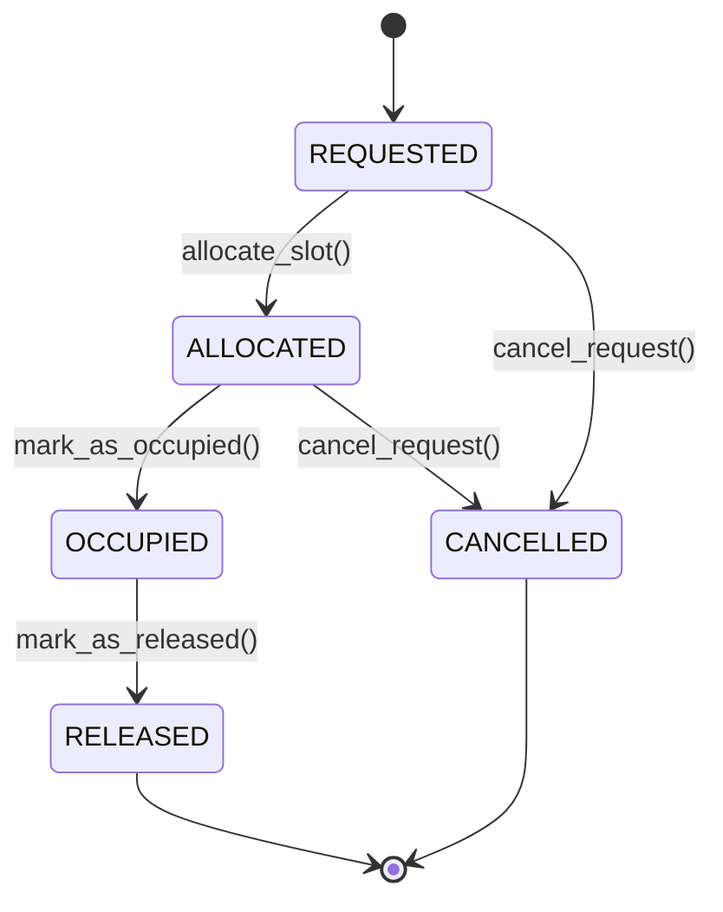

# Smart Parking Allocation System - Design Document

## 1. System Overview

The **Smart Parking Allocation System** is a modular Python application designed to manage and optimize vehicle parking across multiple city zones. The system handles parking requests, allocates slots using specific rules (with cross-zone capabilities), tracks vehicle information, and provides analytics for zone utilization.

The application uses a **Layered Architecture**:
- **Presentation Layer**: Flask-based web interface (HTML/CSS templates, Routes).
- **Business Logic Layer**: `ParkingSystem`, `AllocationEngine`, `RequestManager`, `RollbackManager`.
- **Data Layer**: In-memory storage using specialized data structures (`VehicleBST`, `RequestQueue`, `Zone` hierarchy).

---

## 2. Core Components and Data Structures

### 2.1 Zone Architecture
The city is divided hierarchically:
- **Zone**: Represents a larger geographic area (e.g., Downtown, Uptown).
- **ParkingArea**: A subsection within a zone.
- **ParkingSlot**: The atomic unit where a vehicle parks.

**Data Structure**: Tree-like Hierarchy
- `Zone` contains a list of `ParkingArea` objects.
- `ParkingArea` contains a list of `ParkingSlot` objects.
- `Zone` also maintains an adjacency list (`adjacent_zones`) for relationship tracking.

### 2.2 Vehicle Management
Vehicles are managed efficiently to allow fast lookups by ID.

**Data Structure**: Binary Search Tree (BST)
- **Class**: `VehicleBST`
- **Node**: References a `Vehicle` object.
- **Key**: `vehicle_id` (String)
- **Operations**:
  - `insert(vehicle)`: O(log n)
  - `search(vehicle_id)`: O(log n)

### 2.3 Request Management
Parking requests are processed sequentially but can be accessed randomly for status updates.

**Data Structure**: 
1. **Queue (LinkedList-based)** for incoming requests.
   - **Class**: `RequestQueue`
   - **Operations**: `enqueue` O(1), `dequeue` O(1).
2. **LinkedList** for storing all request history.
   - **Class**: `RequestManager`
   - **Operations**: `add_request` O(1), `find_request` O(n), `remove_request` O(n).

### 2.4 Allocation Engine
Handles the logic for finding available slots.

**Algorithm**:
1. **Search Requested Zone**:
   - Iterates through areas in the requested zone.
   - Returns first available slot.
2. **Cross-Zone Allocation**:
   - **Priority 1**: Check `adjacent_zones` first (lower penalty).
   - **Priority 2**: Round-robin search through all other zones (higher penalty).
   
**Complexity**:
- **Best Case**: O(1) if slot available in first area of requested zone.
- **Worst Case**: O(Z * A * S) where Z=Zones, A=Areas, S=Slots.

### 2.5 Rollback Manager
Allows undoing operations (allocations, cancellations).

**Data Structure**: Stack (LIFO)
- **Class**: `RollbackManager` with `RollbackStack`.
- **Items**: `RollbackAction` objects storing:
  - `action_type`: (ALLOCATE, CANCEL, etc.)
  - `request_id`
  - `previous_state`
  - `slot_id`
- **Operations**: `push` O(1), `pop` O(1).

---

## 3. State Machine Design

The lifecycle of a `ParkingRequest` is managed by a strict state machine to ensure data integrity.

### States:
1. **REQUESTED**: Initial state when user submits a request.
2. **ALLOCATED**: A slot has been assigned to the vehicle.
3. **OCCUPIED**: Vehicle has physically parked (confirmed by user).
4. **RELEASED**: Vehicle has left, slot is free.
5. **CANCELLED**: Request was cancelled before completion.

### Transitions:
- `REQUESTED` -> `ALLOCATED`: Via `allocate_slot()`
- `REQUESTED` -> `CANCELLED`: Via `cancel_request()`
- `ALLOCATED` -> `OCCUPIED`: Via `mark_as_occupied()`
- `ALLOCATED` -> `CANCELLED`: Via `cancel_request()` (Rolls back slot availability)
- `OCCUPIED` -> `RELEASED`: Via `mark_as_released()` (Frees slot)
- `RELEASED` / `CANCELLED`: Terminal states.

---

## 4. Complexity Analysis

### Time Complexity

| Operation | Data Structure | Complexity | Notes |
|-----------|----------------|------------|-------|
| **Register Vehicle** | BST | **O(log N)** | N = Total Vehicles |
| **Search Vehicle** | BST | **O(log N)** | Balanced tree assumed |
| **Create Request** | LinkedList Queue | **O(1)** | Tail insertion |
| **Process Request** | LinkedList Queue | **O(1)** | Head removal |
| **Find Request** | LinkedList | **O(M)** | M = Total Requests |
| **Allocate Slot (Same Zone)** | Nested Lists | **O(S)** | S = Total Slots in Zone |
| **Allocate Slot (Cross Zone)** | Nested Lists | **O(Z * S)** | Z = Total Zones |
| **Rollback Operation** | Stack | **O(1)** | Push/Pop |
| **Zone Analytics** | List Iteration | **O(Z)** | |

### Space Complexity

- **Vehicle Storage**: **O(N)** for N vehicles.
- **Request Storage**: **O(M)** for M requests.
- **Zone/Slot Storage**: **O(Z * A * S)** per system configuration.
- **Rollback Stack**: **O(K)** where K is the max rollback history limit.

---

## 5. Design Decisions & Trade-offs

1. **BST for Vehicles**:
   - **Scanning**: Faster than a list O(N) but slower than a Hash Map O(1).
   - **Reason**: Requirement usually implies specific data structures (BST) for educational purposes or to handle ordered data if needed (e.g., range queries).

2. **LinkedList for Requests**:
   - **Reason**: Efficient O(1) insertion/deletion at ends. While search is O(N), the volume of active requests is typically manageable. A Hash Map index could be added for O(1) lookup improvement.

3. **Separation of ParkingArea and Zone**:
   - **Reason**: Modular design allows different parking rules or types (e.g., covered vs. open) to be added to areas without changing the zone logic.

4. **Rollback Stack**:
   - **Reason**: Simplest and most effective way to handle "Undo" functionality. Stores only the delta (change) needed to reverse the state.
